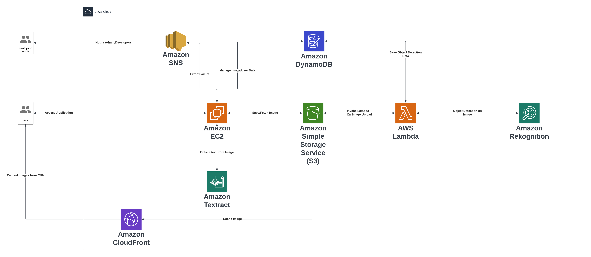

# PicSort

It is an AWS-based, cloud-native image storage application designed to efficiently store user pictures while also offering automated picture sorting into organized directories.

The application can be fully deployed using cloud formation script without any mannual configurations.

## Architecture

The architecture outlines the distinct services utilized to deliver the application, with each service tailored to serve specific use cases.

- **Amazon EC2:** It functions as both the frontend serving component to the user and the backend computation handler. It interacts with Amazon S3 to store user-uploaded images and with DynamoDB to save image and user data. Additionally, it triggers notifications to SNS for any unhandled errors or exceptions that may occur within the backend system. It also interacts with the Amazon Textract to fetch the text from the images.

- **Amazon S3:** It is responsible to store the images uploaded by the users. It also triggers the lambda function whenever any image is uploaded.

- **AWS Lambda:** It engages with Amazon Rekognition when it is triggered by S3, to processing image data. Subsequently, it interacts with DynamoDB to store the extracted data from Rekognition.

- **Amazon Rekognition:** It detects the objects within the image and returns the detected objects data to Lambda.

- **Amazon DynamoDB:** It serves as a data storage for both user data and image data.

- **Amazon SNS:** Upon encountering an unhandled error in the backend, it sends a notification to SNS, which subsequently emails the developers and administrators added to the topic.

- **Amazon CloudFront:** It functions as a CDN, providing users with low-latency access to retrieve images stored in S3.
